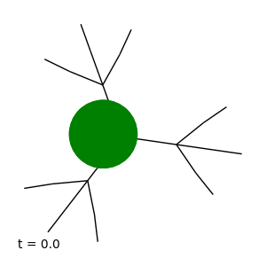

Introduction
============

QSW_MPI is a python package developed for time-series simulation of continuous-time quantum stochastic walks. This model allows for the study of a wide range of Markovian open quantum systems in the Lindblad formalism, which includes a generalization of the classical random walk and continuous-time quantum walk. Consisting of a python interface accessing parallelised Fortran libraries utilising sparse data structures; QSW\_MPI is scalable to massively parallel computers, making possible the simulation of walks on directed and undirected graphs of arbitrary complexity.

