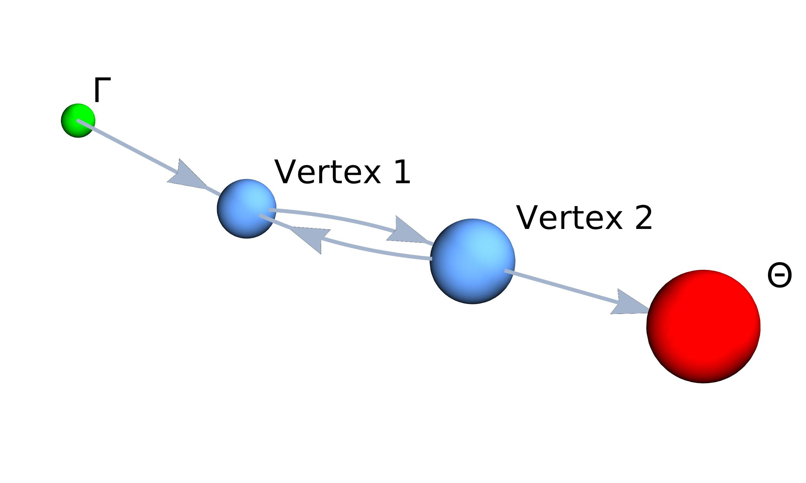

Theory and Definitions
======================

This section provides a self-contained overview of the mathematical formalism underpinning a QSW. The starting point of this is the definition of the CTRW and CTQW on networks, followed by an overview of the master equation approach to the description of Markovian open systems. From this the QSW master equation is then introduced, which unifies the CTRW and CTQW models under a density theoretic framework. The practical extension of this equation to the inclusion of non-Hermitian absorption and emission process is then discussed. We conclude by presenting the vectorized form of the QSW master equation. This produces a structurally simplified form of the Master equation, the numerical approximation of which is the task at hand.

Classical and Quantum Walks
###########################

Networks
********

A network (or 'graph') is defined as an object :math:`\mathcal{G} = (E, V)` comprised of :math:`V = \{1, ...,N\}` vertices (or 'sites') connected by a set of edges :math:`E = \{i \rightarrow j, k \rightarrow l,...\}`. This is represented by an :math:`N \times N` adjacency matrix, :math:`G`,

.. math::
    :label: adjacency_matrix

	G_{ij} =
	\begin{cases}
		G_{ij} > 0, & \exists(i \rightarrow j) \\
		0, & \text{otherwise}
	\end{cases}

where :math:`G_{ij} \in \mathbb{R}` describes the magnitude of connection between two vertices :math:`i` and :math:`j` [1]. Edges of form :math:`A_{ii}` are known as self loops with a graph containing no self loops being referred to as a 'simple'graph. The case where :math:`A_{ij} \neq A_{ji}` encodes directionality into the graph structure, such graphs being referred to as 'directed'. Conversely, graphs for which all :math:`A_{ij} = A_{ji}` are referred to as 'undirected'. The sum total of the outgoing edge weights from vertex :math:`j`,

.. math::
    :label: out_degree

    \begin{equation} \label{eq:out_degree}
    \text{outDeg(j)} = \sum_{i \neq j} G_{ij}
	\end{equation}

is termed the vertex 'out degree' [1].

Continuous-Time Classical Random Walks
**************************************

A CTRW describes the probabilistic evolution of a system (walker) though a parameter space as a continuous function of time [2]. Most typically, CTRWs refer to a type of Markov process. This describes a scenario where the future state of a system depends only on its current state. Heuristically, one might describe such systems as having a 'short memory'. Under this condition a CTRW over a network is described by a system of first order ordinary differential equations,

.. math::
    :label: CTRW

    \begin{equation}
    	\label{CTRW}
    	\frac{d \vec{p}(t)}{dt} = -M \vec{p}(t)
    \end{equation}

where element :math:`p_i \geq 0` of :math:`\vec{p}(t)` is the probability of the walker being found at vertex :math:`i` of the network, and :math:`\vec{p}(t)` has the solution :math:`\vec{p}(t) = \exp(-tM)\vec{p}(0)` which satisfies :math:`\sum\vec{p}(t) = 1` [2]. :math:`M` is the transition matrix derived from :math:`G`,

.. _transition_matrix:

.. math::
    :label: transition_matrix

    \begin{equation}
    	M_{ij} =
    	\begin{cases}
    	-\gamma \ G_{ij}, & i \neq j \\ 
    	\gamma \ \text{outDeg}(j), & i = j
    	\end{cases}
    \end{equation}

where the off-diagonal elements :math:`M_{ij}` represent the probability flow along an edge from vertex :math:`j` to vertex :math:`i`, while the diagonal elements :math:`M_{jj}` account for the total outflow from vertex :math:`j` per unit time. Scalar :math:`\gamma \in \mathbb{R}` is the system wide network transition rate [1].

Continuous-Time Quantum Walks
*****************************

A Continuous-Time Quantum Walk (CTQW) is constructed by mapping :math:`\mathcal{G}` to an :math:`N`-dimensional Hilbert space where the set of its vertices :math:`\{\langle 1 |, ..., \langle N | \}` form an orthonormal basis. The matrix elements of the system Hamiltonian :math:`H` are then equal to the classical transition matrix (:math:`\langle i | H \rangle j| = M_{ij}`). In place of :math:`\vec{p}(t)`, the evolution of the state vector :math:`| \Psi(t) \rangle = \sum_{i=1}^{N} | i \rangle \langle i | \Psi(t) \rangle` is considered, the dynamics of which are governed by the Schrödinger equation [1],

.. _schrodinger_equation:

.. math::
    :label: schrodinger_equation

    \begin{equation}
    	\frac{d | \Psi(t) \rangle }{dt} = %
    	-\frac{\mathrm{i}}{\hbar} H | \Psi(t) \rangle
    \end{equation}

which has the formal solution :math:`| \Psi(t) \rangle = \exp(-i tH) | \Psi(0) \rangle` when :math:`H` is time-independent (using atomic units where :math:`\hbar = 1 \ \text{a.u} =  1.054 \ 571 \times 10^{-34} \text{J.s}` and :math:`t = 2.418 884 \times 10^{-17} s = 24.188 \ 84 \ \text{fs}`). The probability associated with vertex :math:`i` at time :math:`t` is then given by :math:`| \langle i | \Psi(t) \rangle |^2`.

While Equations :eq:`CTRW` and :eq:`schrodinger_equation` appear superficially similar, there are a number of fundamental differences between the two processes. Firstly, :math:`| \Psi(t) \rangle` describes a complex probability amplitude, meaning that its possible paths may interfere. Secondly, the Hermiticity requirement on :math:`H` needed to maintain unitary (probability preserving) evolution of the system dictates that :math:`\mathcal{G}` must be an undirected graph [1, 2].

Markovian Open Quantum Systems
##############################

Density Matrices
****************

A density matrix,

.. _density_matrixdensity_matrix:

.. math::
    :label: density_matrix

    \begin{equation}
    	\rho(t) = \sum_k p_k | \Psi_k(t) \rangle | \Psi_k(t) \langle \text{,}
    \end{equation}

describes a statistical ensemble of quantum states, :math:`| \Psi_k(t) \rangle`, each with an associated probability :math:`p_k \geq 0 \in \mathbb{R}` and :math:`\sum_k p_k = 1`. The case where :math:`p_k` is non-zero for more than one :math:`k` is termed a 'mixed state' while the case of only one non-zero :math:`p_k` is termed a 'pure state'.

Density matrices satisfy: :math:`\rho(t)^\dagger = \rho(t)`, :math:`\text{tr}(\rho(t)) = 1`, :math:`\text{trace}(\rho(t)^2) \leq 1` (with equality holding for only pure states) and :math:`\langle A \rangle = \text{trace}(\rho(t)A)` (where :math:`A` is a quantum operator)  [1]. Diagonal elements :math:`\rho_{ii}` represent the probability density at a given vertex and are termed 'populations', while off-diagonal elements :math:`\rho_{ij}` describe phase coherence between vertices :math:`i` and :math:`j`.

The dynamics of :math:`\rho(t)` are given by the Liouville-von Neumann equation,

.. math::
    :label: lioville_von_neuman

    \begin{equation}
    	\frac{d\rho(t)}{dt} = -\text{i}[H, \rho(t)],
    \end{equation}

which is the density theoretic equivalent of the Schrödinger equation [3].

Quantum Master Equation
***********************

Consider a system, :math:`S`, coupled to an external reservoir (or 'bath'), :math:`B`. The Hilbert space of :math:`S + B` is given by [3],

.. math::
    :label: open_system

    \begin{equation}
    	\mathcal{H} = \mathcal{H}_S \otimes \mathcal{H}_B,
    \end{equation}

where :math:`\mathcal{H}_S` and :math:`\mathcal{H}_B` are the Hilbert spaces of :math:`S` and :math:`B`. :math:`S` is referred to as an 'open' system, while :math:`S + B` is closed in the sense that its dynamics can be described unitarily. Under the conditions that the evolution of S is Markovian with no correlation between S and B at t = 0, and given :math:`\mathcal{H}_S` of finite dimensions :math:`N`. The dynamics of S are described by a generalization of Equation :eq:`lioville_von_neuman` the Kossakowski-Lindblad quantum master equation [3],

.. math::
    :label: kossakowski_lindblad

    \begin{equation}
    			\frac{d\rho_S(t)}{dt} = -\frac{\text{i}}{\hbar}[H, \rho_S(t)] %
    			+ \sum_{k=1}^{N^2}\tau_k(L_k\rho_S(t)L_{k}^{\dagger} %
    			- \frac{1}{2}\{L_{k}^{\dagger}L_k,\rho_S(t)\})
    \end{equation}

where :math:`H` is not necessarily :math:`H_S` as it may incorporate unitary dynamics in both :math:`S` and :math:`B`; the Lindblad operators :math:`L_K` span the Liouville space and the scalars :math:`\tau_k \geq 0 \in \mathbb{R}`. The reduced density operator :math:`\rho(t)_S` is formed by tracing out the degrees of freedom associated with B. Equation :eq:`kossakowski_lindblad` is invariant under unitary transformations of the Lindblad operators, allowing for construction of a wide range of phenomenological models [2].

It is useful to introduce the shorthand,

.. math::
    :label: dissipator

    \begin{equation} \label{eq:KL_eq}
    	\mathcal{D}_k[\rho_S(t)] = \tau_k(L_k\rho_S(t)L_{k}^{\dagger} %
    			- \frac{1}{2}\{L_{k}^{\dagger}L_k,\rho_S(t)\}),
    \end{equation}

which are referred to as a 'dissipator'. Inclusion of these terms results in decoherence and relaxation effects in the dynamics of :math:`\rho_S(t)`, observed mathematically as decay in the off-diagonal coherences of :math:`\rho_S(t)` to zero with sufficient :math:`t`. Importantly, this has the following consequence: processes obeying the master equation have a well defined equilibrium state, which is not the case for unitary dynamics [2].

Quantum Stochastic Walks
########################

Standard Definition
*******************

A QSW on a graph is derived from Equation :eq:`kossakowski_lindblad` by defining :math:`\rho_s(t)` in the basis of vertex states, :math:`\{| 1 \rangle,..., | N \rangle \}`, and constructing a unitary Hamiltonian from the adjacency matrix, :math:`G`, of an arbitrary :math:`\mathcal{G}`,

.. math::
    :label: hamiltonian

    \begin{equation}
    	H_{ij} =
    	\begin{cases}
    	-\gamma \ \text{max}(G_{ij},G_{ji}), & i \neq j \\
    	\gamma \ \text{outDeg(j)}, & i = j
    	\end{cases}
    \end{equation}

and the Lindblad operators from its transition matrix :math:`M` (Equation :eq:`transition_matrix`),

.. math::
    :label: lindblad

    \begin{equation}
    	L_{k}=\sqrt{|M_{ij}|} | i \rangle \langle j | ,
    \end{equation}

where :math:`k=N(j-1)+i`. Each :math:`L_k` then describes an incoherent scattering channel along a directed graph edge. Importantly, this allows for the encoding of directness resulting from the edge weights of :math:`\mathcal{G}` into the walk's dynamics [1]. In the context of QSW_MPI :math:`L_k` are represetned in memory as:

.. math::
    :label: lindblad_sum

    \begin{equation}
	L = \sum_{1}^{k} L_{k}.
    \end{equation}

Finally, a scalar decoherence parameter :math:`0 \leq \omega \leq 1` is introduced [4]. This allows for the model to be easily tuned to explore a continuum of mixed quantum and classical dynamics. The standard form of a QSW is then,

.. math::
    :label: qsw

	\begin{equation}
		\frac{d\rho(t)}{dt} = -\text{i}(1-\omega)[H, \rho(t)] %
		+ \omega \sum_{k=1}^{N^2} \mathcal{D}_k[\rho(t)]
	\end{equation}

with :math:`\rho_s(t)` denoted as :math:`\rho(t)` and :math:`\tau_k = \omega` for all dissipator terms. At :math:`\omega = 0`, Equation :eq:`qsw` reduces to a CTQW obeying the Liouville-von Neumann equation (Equation :eq:`lioville_von_neuman`) and, at :math:`\omega = 1`, the density-matrix equivalent of the CTRW equation (Equation :eq:`CTRW`) is obtained.

Extension to Absorption and Emission
************************************

The QSW model naturally facilitates the modelling of absorption and emission processes through the inclusion of Lindblad operators describing scattering channels that do not have a counterpart in the coherent Hamiltonian. The addition of these dynamics to the QSW framework have been derived formally [2]. With the QSW operators in their matrix representations, this is practically achieved by forming the Lindblad operators from an augmented adjacency matrix, :math:`G_\text{aug}`, containing :math:`G` and the additional channels as non-symmetric edge weights. Here, the absorption channels (sources) are,

.. _source:

.. math::
    :label: source

    \begin{equation}
        G_\Gamma = \{\Gamma_k \subset G_\text{aug} : i > N, j \leq N\}
    \end{equation}

and emission channels (sinks),

.. _sink:

.. math::
    :label: sink

    \begin{equation}
        G_\Theta = \{\Theta_k \subset G_\text{aug} : i \leq N, j > N\},
    \end{equation}

where :math:`k = \tilde{N}(j-1) + i` with :math:`\tilde{N}` equal to :math:`N` plus the total number of sources and sinks, and :math:`\Gamma_k > 0 \in \mathbb{R}` is the absorption rate at vertex :math:`j` and :math:`\Theta > 0 \in \mathbb{R}` is the emission rate at vertex :math:`i`. A vertex in the non-augmented network to which a source is attached is referred to as an absorption vertex, while a vertex to which an emission channel is attached is referred to as an emission vertex.

For example, consider thea dimer graph shown below on which absorption is modeled at vertex 1 (:math:`\Gamma_9 = 2`) and emission at vertex 2 (:math:`\Theta_8 = 3`). The corresponding QSW has :math:`H` formed by adjacency matrix :math:`G`, the unaugmented :math:`2 \times 2` adjacency padded to maintain dimensional consistency, and its Lindblad operators derived from :math:`G_\text{aug}`.

.. math::

    \begin{align}
    G = \begin{bmatrix}
    0 & 1 & 0 &0 \\ 
    1 & 0 & 0 & 0\\ 
    0 & 0 & 0 & 0\\ 
    0 & 0 & 0 & 0
    \end{bmatrix}, &&
    G_{\text{aug}}=\begin{bmatrix}
    0 & 1 & 2 &0 \\ 
    1 & 0 & 0 & 0\\ 
    0 & 0 & 0 & 0\\ 
    0 & 3 & 0 & 0
    \end{bmatrix}.
    \end{align}

As such, a QSW incorporating both absorptive and emissive processes may be succinctly expressed as,

.. _qsw_full:

.. math::
    :label: qsw_full

    \begin{align}
    \begin{split}
    \mathcal{L}[\rho(t)] = &
    \frac{d\rho(t)}{dt} = -\text{i}(1-\omega)[H, \rho(t)] &
    + \omega \sum_{k \in G}^{N^2} \mathcal{D}_k[\rho(t)] &
    + \sum_{k \in G_\Gamma} \Gamma_k \mathcal{D}_k[\rho(t)] &
    + \sum_{k \in G_\Theta} \Theta_k \mathcal{D}_k[\rho(t)] &
    \end{split}
    \end{align}

with :math:`\rho(t)` being of dimensions :math:`\tilde{N} \times \tilde{N}`.

References
##########

[1] P. E. Falloon, J. Rodriguez, J. B. Wang, QSWalk: a Mathematica package for quantum stochastic walks on arbitrary graphs, Computer Physics Communications 217 (2017) 162–170. doi:10.1016

[2] P. Schijven, Quantum stochastic walks: a model for coherent and incoherent transport on networks, Ph.D. thesis (Jan. 2014).

[3]  H.-P. Breuer, F. Petruccione, The theory of open quantum systems, nachdr. Edition, Clarendon Press, Oxford, 2009, oCLC: 553486996.

[4] J. D. Whitfield, C. A. Rodriguez-Rosario, A. Aspuru-Guzik, Quantum stochastic walks:  A generalization of classical random walks and quantum walks, Physical Review A 81 (2). doi:10.1103
