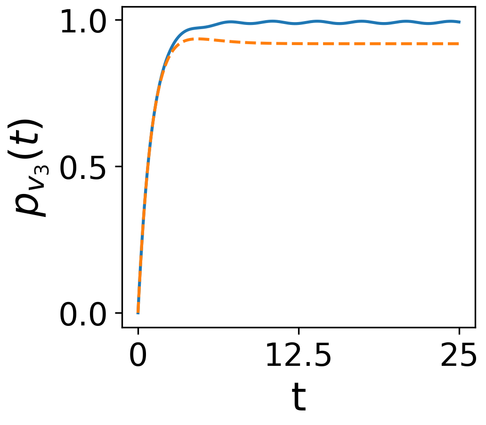
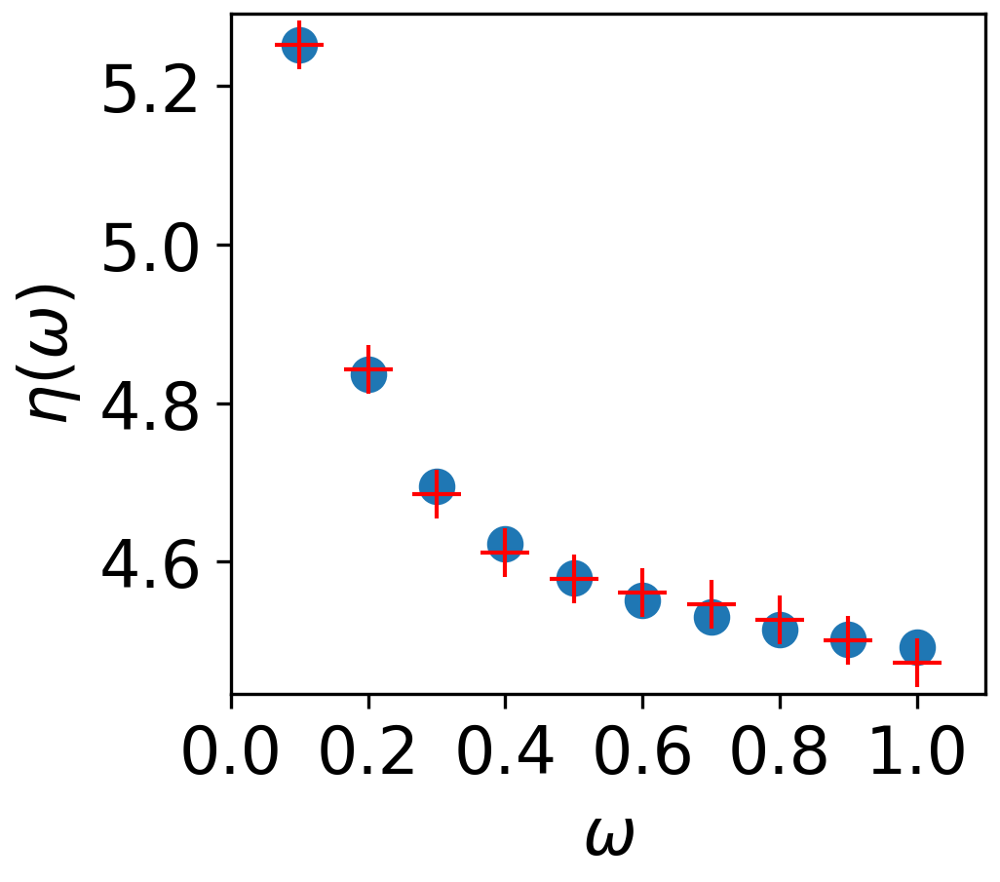

.. _sec:theory:

Theory
======

This section provides an overview of the mathematical formalism
underpinning QSWs. The starting point is a discussion of graph theory
terminology, which draws primarily from Refs. `1` and `2`,
followed definition of CTRWs on digraphs and CTQWs on graphs. An
overview of the master equation approach to the description of Markovian
open systems is then provided. From this, the L-QSW master equation is
introduced, which unifies the CTRW and CTQW models under a density
theoretic framework. The practical extension of this equation to the
inclusion of non-Hermitian absorption and emission process is then
presented. Next, the G-QSW is introduced, along with the demoralisation
correction scheme. We conclude by discussing vectorization of the QSW
master equations, the numerical approximation of which is the primary
task at hand.

.. _sec:graphs:

Digraphs and Graphs
-------------------

A weighted digraph is defined as a triple
:math:`\mathcal{G} = (V,E,\text{w})`. Vertex set
:math:`V = \{v_1, ...,v_N\}` is connected by arcs from the set
:math:`E = \{(v_i, v_j), (v_k, v_l),...\}`. Each arc is associated with
a positive weight, :math:`\text{w}(v_i,v_j) \in \mathbb{R}`, which
describe the magnitude of connection from :math:`v_i` to :math:`v_j`.
:math:`\mathcal{G}` is represented by an :math:`N \times N` adjacency
matrix, :math:`G`:

.. math::
   :label: eq:adjacency_graph

       G_{ji} =
       \begin{cases}
           \text{w}(v_i,v_j), & (v_i, v_j) \in E \\
           0, & \text{otherwise}.
       \end{cases}

Arcs of form :math:`(v_i, v_i)` are known as self-loops, with a graph
containing no self-loops being referred to as a ‘simple graph’. QSW_MPI
considers only the case of simple graphs, as such
:math:`\text{Tr}(G) = 0`.

Associated with :math:`\mathcal{G}` is the weighted but undirected graph
:math:`\mathcal{G}^u = (V,E^u,\text{w}^u)`, where :math:`E^u` is a set
of edges associated with weights :math:`\text{w}^u`. This is represented
by a symmetric adjacency matrix, :math:`G^u`, with
:math:`\text{w}^u(v_i,v_j)= \text{max}(\text{w}(v_i,v_j),\text{w}(v_j,v_i))`
according to Equation :eq:`eq:adjacency_graph`.
A digraph is weakly connected if there exists a path between all
:math:`v_i \in \mathcal{G}^u`. Additionally, a digraph which satisfies
the further condition of having a path between all
:math:`v_i \in \mathcal{G}` is strongly connected.

The number of arcs (or edges) incident on vertex :math:`v_j`,

.. math:: \text{Deg}(v_j) = \text{dim}(\{(v_i,v_j)\}),

is termed the vertex degree and the total sum of the incident edge
weights on vertex :math:`v_j`,

.. math::
   :label: eq:in_degree

       \text{InDeg}(v_j) = \sum_{i \neq j}\text{w}(v_i,v_j),

is termed the weighted vertex in-degree. Similarly, the total sum of the
outgoing edge weights at vertex :math:`v_i`,

.. math::
   :label: eq:out_degree

     \text{OutDeg}(v_i) = \sum_{i \neq j}\text{w}(v_i,v_j),

is termed the weighted vertex out-degree. A vertex, :math:`v_i`, with
:math:`\text{OutDeg}(v_i) > 0` and :math:`\text{InDeg}(v_i) = 0` is
refered to as a source. Conversely, a vertex, :math:`v_j`, with
:math:`\text{InDeg}(v_j) > 0` and :math:`\text{OutDeg}(v_j) = 0` is
refered to as a sink. A graph with constant :math:`\text{Deg}(v_i)`, or
a digraph satisfying the additional condition of
:math:`\text{OutDeg}(v_i) = \text{InDeg}(v_i)` for all
:math:`v_i \in \mathcal{G}`, is referred to as a regular graph.

Continuous-Time Classical Random Walks
--------------------------------------

A continuous-time random walk (CTRW) describes the probabilistic
evolution of a system (walker) though a parameter space as a continuous
function of time. Most typically, CTRWs refer to a type of Markov
process. This describes a scenario where the future state of a system
depends only on its current state. Heuristically, one might describe
such systems as having ‘no memory’. Under this condition, a CTRW over a
digraph is described by a system of first-order ordinary differential
equations,

.. math::
   :label: eq:CTRW

       \frac{d \vec{p}(t)}{dt} = -M \vec{p}(t)

where element :math:`p_i \geq 0` of :math:`\vec{p}(t)` is the
probability of the walker being found at :math:`v_i`, and
:math:`\vec{p}(t)` has the solution
:math:`\vec{p}(t) = \exp(-tM)\vec{p}(0)` which satisfies
:math:`\sum\vec{p}(t) = 1`\ :sup:`3,4`. :math:`M` is the transition
matrix derived from :math:`G`,

.. math::
   :label: eq:generator_matrix

       M_{ij} =
       \begin{cases}
       -\gamma \ G_{ij}, & i \neq j \\ 
       \gamma \ \text{OutDeg}(j), & i = j
       \end{cases}

where the off-diagonal elements :math:`M_{ij}` represent the probability
flow along an edge from :math:`v_j` to :math:`v_i`, while the diagonal
elements :math:`M_{jj}` account for the total outflow from :math:`v_j`
per unit time. Scalar :math:`\gamma \in \mathbb{R}` is the system wide
transition rate\ :sup:`2`.

Continuous-Time Quantum Walks
-----------------------------

A continuous-time quantum walk (CTQW) is constructed by mapping
:math:`\mathcal{G}` to an :math:`N`-dimensional Hilbert space where the
set of its vertices
:math:`\{\lvert v_1 \rangle, ..., \lvert v_N \rangle\}` form an
orthonormal basis. The matrix elements of the system Hamiltonian
:math:`H` are then equal to the classical transition matrix
(:math:`\langle v_j \rvert H\lvert v_i \rangle = M_{ij}`). In place of
:math:`\vec{p}(t)`, the evolution of the state vector
:math:`\lvert \Psi(t) \rangle = \sum_{i=1}^{N} \lvert v_i \rangle\langle v_i \vert \Psi(t) \rangle`
is considered, the dynamics of which are governed by the Schrödinger
equation\ :sup:`2`,

.. math::
   :label: eq:CTQW

       \frac{d \lvert \Psi(t) \rangle}{dt} = %
       -\frac{\mathrm{i}}{\hbar} H \lvert \Psi(t) \rangle

which has the formal solution
:math:`\lvert \Psi(t) \rangle = \exp(-\frac{i}{\hbar}tH)\lvert \Psi(0) \rangle`
when :math:`H` is time-independent. The probability associated with
vertex :math:`v_i` at time :math:`t` is
:math:`|\langle v_i \vert \Psi(t) \rangle|^2`.

While Equations :eq:`eq:CTRW` and
:eq:`eq:CTQW` appear superficially similar, there are
several fundamental differences between the two processes. Firstly,
:math:`\lvert \Psi(t) \rangle` describes a complex probability
amplitude, meaning that its possible paths may interfere. Secondly, the
Hermiticity requirement on :math:`H` needed to maintain unitary
evolution of the system dictates that :math:`M` be derived from
:math:`\mathcal{G}^u`\ :sup:`4`.

Markovian Open Quantum Systems
------------------------------

A density matrix,

.. math::
   :label: eq:density matrix

       \rho(t) = \sum_k p_k \lvert \Psi_k(t) \rangle\langle \Psi_k(t) \rvert \text{,}

describes a statistical ensemble of quantum states,
:math:`\lvert \Psi_k(t) \rangle`, each with an associated probability
:math:`p_k \geq 0` and :math:`\sum_k p_k = 1`. The case where
:math:`p_k` is non-zero for more than one :math:`k` is termed a ‘mixed’
state while the case of only one non-zero :math:`p_k` is termed a ‘pure’
state. The dynamics of :math:`\rho(t)` are given by the Liouville-von
Neumann equation,

.. math::
   :label: eq:liouville-von-neumann

       \frac{d\rho(t)}{dt} = -\frac{\text{i}}{\hbar}[H, \rho(t)],

which is the density theoretic equivalent of the Schrödinger equation
(Equation :eq:`eq:CTQW`)\ :sup:`5`. In a quantum walk
context, entries :math:`\rho_{ii}` (termed ‘populations’) represent the
probability density at a given vertex while off-diagonal elements
:math:`\rho_{ij}` describe phase coherence between vertices :math:`v_i`
and :math:`v_j`\ :sup:`2`.

Consider a system, :math:`S`, coupled to an external reservoir (or
‘bath’), :math:`B`. The Hilbert space of :math:`S + B` is given
by\ :sup:`5`,

.. math::
   :label: eq:open_hilbert_space

       \mathcal{H} = \mathcal{H}_S \otimes \mathcal{H}_B,

where :math:`\mathcal{H}_S` and :math:`\mathcal{H}_B` are the Hilbert
spaces of :math:`S` and :math:`B`. :math:`S` is referred to as an ‘open’
system, while :math:`S + B` is closed in the sense that its dynamics can
be described unitarily. Under the condition that the evolution of
:math:`S` is Markovian with no correlation between :math:`S` and
:math:`B` at t = 0, and given :math:`\mathcal{H}_S` of finite dimensions
:math:`N`. The dynamics of :math:`S` are described by a generalization
of Equation
:eq:`eq:liouville-von-neumann`: the GKSL
quantum master equation\ :sup:`5`,

.. math::
   :label: eq:gksl

     \frac{d\rho_S(t)}{dt} = -\frac{\text{i}}{\hbar}[H, \rho_S(t)] + \sum_k \mathcal{D}_k[\rho_S(t)]

with

.. math::
   :label: eq:KL_eq

       \mathcal{D}_k[\rho_S(t)] = \tau_k(L_k\rho_S(t)L_{k}^{\dagger} %
     - \frac{1}{2}\{L_{k}^{\dagger}L_k,\rho_S(t)\}),

where :math:`H` is the Hamiltonian describing the unitary dynamics of
:math:`\mathcal{H}_s`, the Lindblad operators, :math:`L_k`, span the
Liouville space and scalars :math:`\tau_k \geq 0`. The reduced density
operator :math:`\rho_s(t)` is formed by tracing out the degrees of
freedom associated with :math:`B`. Equation :eq:`eq:gksl`
is invariant under unitary transformations of the Lindblad operators,
allowing for the construction of a wide range of phenomenological
models.

.. _sec:qsw:

Quantum Stochastic Walks
------------------------

.. _sec:l_qsw:

Local Environment Interaction
~~~~~~~~~~~~~~~~~~~~~~~~~~~~~

A local-interaction quantum stochastic walk (L-QSW) on an arbitrary
simple :math:`\mathcal{G}` is derived from Equation
:eq:`eq:KL_eq` by defining :math:`\rho_s(t)` in the basis
of vertex states, :math:`\{\lvert v_1 \rangle,...,\lvert v_N \rangle\}`,
setting :math:`H` equal to the transition matrix of :math:`G^u`, and
deriving the local interaction Lindblad operators from the transition
matrix of :math:`G`,

.. math::
   :label: eq:lindblad

       L_{k}=\sqrt{|M_{ij}|}\lvert v_i \rangle\langle v_j \rvert.

where :math:`k=N(j-1)+i`. Each :math:`L_k` describes an incoherent
scattering channel along an arc of :math:`\mathcal{G}` when
:math:`i \neq j` and dephasing at :math:`v_i` when
:math:`i = j`\ :sup:`2,4`.

A scalar decoherence parameter :math:`0 \leq \omega \leq 1` is
introduced\ :sup:`4`. This allows for the model to be easily tuned to
explore a continuum of mixed quantum and classical dynamics. The
standard form of a QSW is then,

.. math::
   :label: eq:qsw

               \frac{d\rho(t)}{dt} = -\text{i}(1-\omega)[H, \rho(t)] %
               + \omega \sum_{k=1}^{N^2} \mathcal{D}_k[\rho(t)]

with :math:`\rho_s(t)` denoted as :math:`\rho(t)` and :math:`\tau_k = 1`
for all dissipator terms. At :math:`\omega = 0`, Equation
:eq:`eq:qsw` reduces to a CTQW obeying the Liouville-von
Neumann equation (Equation
:eq:`eq:liouville-von-neumann`) and, at
:math:`\omega = 1`, the density-matrix equivalent of the CTRW equation
(Equation :eq:`eq:CTRW`) is obtained.

It is worth noting that QSWs are defined elsewhere directly from
:math:`G` and :math:`G^u`, such that
:math:`\langle v_j \rvert L_k\lvert v_i \rangle = G_{ij}` and
:math:`\langle v_j \rvert H\lvert v_i \rangle = G^u_{ij}`\ :sup:`6`.
Additionally, the continuous-time open quantum walk (CTOQW) :sup:`7`
defines quantum walks on undirected graphs obeying Equation
:eq:`eq:gksl`, where :math:`H` is defined by Equation
:eq:`eq:generator_matrix` and, in place of
:math:`\sqrt{M_{ij}}` in Equation :eq:`eq:lindblad`, is
the canonical Markov chain transition matrix,

.. math::
   :label: eq:markov_chain

       C_{ij} =  
       \begin{cases}
       \frac{1}{\text{OutDeg}(v_j)}, & (v_i, v_j) \in E \\ 
       0, & \text{otherwise}. 
       \end{cases}

In each case, these walks are consistent with the generalised definition
of QSWs with locally-interacting Lindblad operators\ :sup:`4`.

For L-QSWs, a predictable block structure in :math:`\tilde{\mathcal{L}}`
means that the L-QSW super-operator can be efficiently constructed
directly from the CSR representations of :math:`H` and a single-matrix
representation of the local-interaction Lindblad operators,

.. math::
   :label: eq:condensed_lindblads

   M_L = \sqrt{|M_{ij}|},

thus avoiding the need to form intermediate Kronecker products or store
each Lindblad operator separately.

.. figure:: graphics/dimer_aug.jpeg
   :width: 60%
   :align: center
   :name: fig-dimer

   A dimer graph with a source, :math:`v_3`, attached to :math:`v_1` with absorption rate :math:`\Gamma_{3}` and sink, :math:`v_4` attached to :math:`v_2` with emission rate :math:`\Theta_{14} = 3` (see Equations :eq:`eq:dimer_aug`) and (:eq:`eq:qsw_ss`).

The local interaction QSW model naturally facilitates the modelling of
non-Hermitian transport through connected :math:`\mathcal{G}`. This is
achieved by introducing a source vertex set, :math:`V^\Gamma`, and a
sink vertex set, :math:`V^\Theta`, which are connected unidirectionaly
to :math:`\mathcal{G}` by arc sets :math:`E^\Gamma` and
:math:`E^\Theta`. Together with :math:`\mathcal{G}`, these form the
augmented digraph, :math:`\mathcal{G}^{\text{aug}}`. For example,
consider the dimer graph shown in :numref:`fig-dimer` on
which absorption is modeled at :math:`v_1` and emission at :math:`v_2`.
In QSW_MPI, :math:`G^u` and
:math:`G^{\text{aug}} = G + G^\Gamma + G^\Theta` are represented as,

.. math::
   :label: eq:dimer_aug

   G^u = \begin{bmatrix}
   0 & 1 & 0 &0 \\ 
   1 & 0 & 0 & 0\\ 
   0 & 0 & 0 & 0\\ 
   0 & 0 & 0 & 0
   \end{bmatrix}, &&
   G^{\text{aug}}=\begin{bmatrix}
   0 & 1 & 2 &0 \\ 
   1 & 0 & 0 & 0\\ 
   0 & 0 & 0 & 0\\ 
   0 & 3 & 0 & 0
   \end{bmatrix}.

The walk Hamiltonian is then derived from :math:`G^u` and the
:math:`L_k` corresponding to scattering and dephasing on
:math:`\mathcal{G}` from :math:`G`. Finally, :math:`L_k` originating
from :math:`\mathcal{G}^\Gamma` and :math:`\mathcal{G}^\Theta` are
formed as
:math:`\langle v_j \rvert L_k\lvert v_i \rangle = G^{\Gamma}_{ij}` and
:math:`\langle v_j \rvert L_k\lvert v_i \rangle = G^{\Theta}_{ij}`
respectively, appearing in additional terms appended to Equation
:eq:`eq:qsw` outside the scope of :math:`\omega`. An L-QSW
incorporating both absorptive and emissive processes is then succinctly
expressed as,

.. math::
   :label: eq:qsw_ss

   \frac{d\rho(t)}{dt} = -\text{i}(1-\omega)[H, \rho(t)] + \omega \sum_{k = 1}^{\tilde{N}^2} \mathcal{D}_k[\rho(t)] \\ 
   + \sum_{k = 1}^{\tilde{N}^2}\mathcal{D}^{\Gamma}_k[\rho(t)] + \sum_{k = 1} ^{\tilde{N}^2}\mathcal{D}^{\Theta}_k[\rho(t)]

where :math:`k = \tilde{N}(j-1) + i` with :math:`\tilde{N}` equal to
:math:`N` plus the total vertices in :math:`V^\Gamma` and
:math:`V^\Theta`, and :math:`\rho(t)` is of dimensions
:math:`\tilde{N} \times \tilde{N}`. Terms
:math:`\mathcal{D}^{\Gamma}_k[\rho(t)]` are defined as per Equation
:eq:`eq:KL_eq` with :math:`\tau_k = \Gamma_k` where
:math:`\Gamma_k` is the absorption rate from source
:math:`v_j \in \mathcal{G}^\Gamma` to vertex
:math:`v_i \in \mathcal{G}`. Similarly, for
:math:`\mathcal{D}^{\Theta}_k[\rho(t)]`, :math:`\tau_k = \Theta_k` where
:math:`\Theta_k` is the emission rate from vertex
:math:`v_j \in \mathcal{G}` to sink
:math:`v_i \in \mathcal{G}^{\Theta}`.

.. _sec:g_qsw:

Global Environment Interaction
~~~~~~~~~~~~~~~~~~~~~~~~~~~~~~

A global-interaction quantum stochastic walk (G-QSW) differs from an
L-QSW in that it utilizes a single Lindblad operator derived from the
digraph adjacency matrix,

.. math::
   :label: eq:L_global

   L_{\text{global}} = \sum_{i,j=1}^{N}G_{ij}\lvert v_i \rangle\langle v_j \rvert.

However, a Lindblad operator of this form has the potentially
undesirable effect of inducing transitions between not-connected
vertices with outgoing arcs incident on a common vertex, a phenomena
termed spontaneous moralisation. A demoralisation correction scheme can
be applied to arrive at a non-moralising G-QSW (NM-G-QSW), which
respects the connectivity of the originating digraph. This proceeds by a
homomorphic mapping of :math:`\mathcal{G}` and :math:`\mathcal{G}^u` to
an expanded vertex space\ :sup:`1`. First supported by
QSWalk.jl\ :sup:`6`, provided here is a practical overview of the
process which is implemented in QSW_MPI with respect to weighted
digraphs.

.. _par:demoralisation:

Graph Demoralisation
^^^^^^^^^^^^^^^^^^^^

.. _demoral:

#. From :math:`\mathcal{G}^u = (V, E^u, \text{w}^u)`, construct a set of
   vertex subspaces :math:`V^D = \{V^D_i\}` with,

   .. math::

      V^D_i = 
      \begin{cases}
      \{v^0_i,...,v^{\text{Deg}(v_i)-1}_i\}, & \text{Deg}(v_i)>0 \\
      \{v^0_i\}, & \text{Deg}(v_i) = 0
      \end{cases}

   for each :math:`v_i \in V`. Associated with :math:`V^D` is edge set
   :math:`E^{uD} = \{(v^i_j,v^k_l), (v^m_n,v^o_p),...\}`, where
   :math:`(v^l_i,v^k_j) \in E^{uD} \iff (v_i,v_k) \in E^u`. These have
   weights,

   .. math::
      :label: eq:nm_weight 

          \text{w}^{uD}(V_i^D,V_k^D) =  \left(\text{SubDeg}(V_i^D,V_k^D)\text{w}^u(v_i,v_k)\right)^{-\frac{1}{2}}

   where
   :math:`\text{SubDeg}(V^D_i,V^D_k) = \dim(\{(v_i^l,v_k^j) : (v_i^l,v_k^j) \in E^{uD}\})`.
   This forms the demoralised graph,
   :math:`\mathcal{G}^{uD} = (V^D,E^{uD}, \text{w}^{uD})`.

#. Construct the demoralised digraph,
   :math:`\mathcal{G}^D = (V^D,E^D,\text{w}^D)` where
   :math:`(v_i^j,v_k^l) \in E^D \iff (v_i,v_k) \in E`. Arc weights,
   :math:`\text{w}^D(V^D_i,V^D_k)`, are given by Equation
   :eq:`eq:nm_weight` with :math:`\text{w}(v_i,v_k)`
   in place of :math:`\text{w}^u(v_i,v_k)` and :math:`E^D` in place of
   :math:`E^{uD}`.

#. Form the Lindblad operator from orthogonal matrices,
   :math:`\{F_i\}\in \mathbb{C}^{\dim(V^D_i) \times \dim(V^D_i)}`, such
   that,

   .. math::
      :label: eq:dm_lind

          L^D = [F_i]_{j+1,k}\text{G}^{D}_{v_i^j,v_k^l}\lvert v^j_i \rangle \langle v^l_k \rvert,

   and QSW_MPI follows the convention of choosing for :math:`\{F_i\}`
   the Fourier matrices\ :sup:`6`.

#. Construct the rotating Hamiltonian,

   .. math::
      :label: eq:H_rot

          \langle v^k_l \rvert H^D_{\text{rot}} \lvert v^i_j \rangle =
          \begin{cases}
            \text{i}, & l=j \text{ and } i = k + 1 \\
            -\text{i}, & l=j \text{ and } i = k - 1 \\
            0, & \text{otherwise}
          \end{cases}

   which changes the state within subspaces of :math:`V^D` in order to
   prevent occurrence of stationary states dependant only on the
   expanded vertex set of :math:`\mathcal{G}^D`.

Through formation of :math:`L^D`, spontaneous moralisation is destroyed
but its induced dynamics may not correspond with symmetries present in
:math:`\mathcal{G}`. In this case, symmetry may be reintroduced by
constructing additional :math:`L^D` using unique permutations of
:math:`\{F_i\}`. However, the generality of this symmetrisation process
has not been confirmed\ :sup:`1`. The master equation of a NM-G-QSW is
then,

.. math::
   :label: eq:nm_gqsw

   \frac{d\rho^D(t)}{dt} = -\text{i}(1-\omega)[H^D, \rho^D(t)] \\ 
   + \omega \left( \text{i}[H^D_{\text{rot}}, \rho^D(t)] + \sum_{\{L^D\}} \mathcal{D}_k[\rho^D(t)] \right).

where :math:`H^D` is formed from :math:`\mathcal{G}^{uD}` as per
Equation :eq:`eq:generator_matrix`. The
probabilities of the demoralised density operator, :math:`\rho^{D}(t)`,
are related to the probability of measuring the state in vertex
:math:`v_i` at time :math:`t` by

.. math::
   :label: eq:nm_rho_map

     p(v_i, t) = \sum_{v^k_i \in V_i^D}\langle v^k_i \rvert\rho^{D}(t)\lvert v^k_i \rangle.

Vectorization of the Master Equation
~~~~~~~~~~~~~~~~~~~~~~~~~~~~~~~~~~~~

Equations :eq:`eq:qsw`, :eq:`eq:qsw_ss` and
:eq:`eq:nm_gqsw` may be recast as a system of first
order differential equations through their representation in an
:math:`\tilde{N}^2 \times \tilde{N}^2` Liouville space\ :sup:`5`, where
:math:`\tilde{N}` is the dimension of the system. This process, termed
‘vectorization’, makes use of the identity
:math:`\text{vec}(XYZ) = (Z^T \otimes X)\text{vec}(Y)`\ :sup:`8` to
obtain the mappings,

.. math::
     :label: eq:vec_mappings

     [X,Y] & \leftrightarrow (I \otimes X - X^T \otimes I)\text{vec}(Y), \\
     \{X,Y\} & \leftrightarrow (I \otimes X + X^T \otimes I)\text{vec}(Y), \\
     XBX^{\dagger} & \leftrightarrow (X^* \otimes X)\text{vec}(Y)

where :math:`X, Y, Z \in \mathbb{C}^{\tilde{N} \times \tilde{N}}`. Such
that, for each QSW variant, its equation of motion has the solution,

.. math::
   :label: eq:qsw_vec_sol

      \tilde{\rho}(t) = \exp(t\tilde{\mathcal{L}})\tilde{\rho}(0),

where the vectorized density operator, :math:`\tilde{\rho}(t)`, is
related :math:`\rho(t)` by :math:`\tilde{\rho}(t)_k = \rho(t)_{ij}` with
:math:`k = \tilde{N}(j-1)  + i`.

For an L-QSW on :math:`\mathcal{G}` (Equation :eq:`eq:qsw`),

.. math::
   :label: eq:vec_op

   \begin{split}
       \tilde{\mathcal{L}} = & -(1-\omega)i(I_{\tilde{N}} \otimes H - H^T \otimes I_{\tilde{N}}) \\
       & + \omega \sum_{k=1}^{\tilde{N}^2}(L_{k}^* \otimes L_k - \frac{1}{2}(I_{\tilde{N}} \otimes L_{k}^{\dagger}L_k + L_{k}^{T}L_{k}^* \otimes I_{\tilde{N}})) \\
   \end{split}

is the vectorized superoperator. The vectorized forms of
:math:`\tilde{\mathcal{L}}` for Equations :eq:`eq:qsw_ss`
and :eq:`eq:nm_gqsw` are trivially obtained by
comparison to Equations :eq:`eq:qsw` and
:eq:`eq:vec_op`.

.. _chap:QSW:

Package Overview
================

QSW simulation occurs through use of the
:mod:`~qsw_mpi.MPI` submodule which allows the creation of distributed
:math:`\tilde{\mathcal{L}}`, vectorization of :math:`\rho(0)`, and
evolution of the system dynamics. In particular, the user creates and
calls methods from one of the following :class:`~qsw_mpi.MPI.walk` classes:

-  :class:`~qsw_mpi.MPI.LQSW`: L-QSWs (Equations :eq:`eq:qsw` and :eq:`eq:qsw_ss`).

-  :class:`~qsw_mpi.MPI.GQSW`: G-QSWs (Equation :eq:`eq:L_global` and :eq:`eq:nm_gqsw`).

-  :class:`~qsw_mpi.MPI.GKSL`: Walks obeying the GKSL master equation  (Equation :eq:`eq:gksl`).

A :class:`~qsw_mpi.MPI.walk` object is instantiated by passing to it the relevant
operators, coefficients and MPI-communicator. On doing so the
distributed :math:`\tilde{\mathcal{L}}` is generated and its 1-norm
series calculated [1]_. After this the user defines :math:`\rho(0)` and
generates the distributed :math:`\tilde{\rho}(0)` via the
:meth:`~qsw_mpi.MPI.initial_state` method.

Simulations are carried out for a single time point with the :meth:`~qsw_mpi.MPI.walk.step`
method or for a number of equally spaced points using the :meth:`~qsw_mpi.MPI.walk.series`
method. These return :math:`\tilde{\rho}(t)` (or
:math:`\tilde{\vec{\rho}}(t)`) as a distributed vectorized matrix(s)
which can be reshaped and gathered to a specified MPI process via
:meth:`~qsw_mpi.MPI.walk.gather_result`, or measured via :meth:`~qsw_mpi.MPI.walk.series.gather_populations`. Otherwise,
results may be reshaped and saved directly to disk using :meth:`~qsw_mpi.MPI.walk.save_result`
or :meth:`~qsw_mpi.MPI.walk.save_population`. File I/O is carried out using h5py\ :sup:`10`, a
Python interface to the HDF5 libraries, and will default to MPI
parallel-I/O methods contained in the non-user accessible
`parallel_io`` module if such operations are supported by the
host system. Finally, a second user accessible module
:mod:`~qsw_mpi.operators` provides for creation of L-QSW and NM-G-QSW
operators from :math:`\mathcal{G}` stored in the SciPy CSR matrix
format\ :sup:`11`.

The following provides an overview of QSW_MPI workflows using examples
drawn from prior studies. These correspond to files included in
‘examples’ folder of the QSW_MPI package. In addition to the program
dependencies of QSW_MPI, the example programs make use of the Python
packages Networkx\ :sup:`12` for graph generation, and
Matplotlib\ :sup:`13` for visualisation. Note that a complete accounting
of the methods contained in QSW_MPI exceeds the scope of this document.
Comprehensive documentation and installation instructions are included
with the package and are additionally hosted on Read the
Docs\ :sup:`14`.

.. _sec:usage:

Usage Examples
--------------

Execution
~~~~~~~~~

QSW_MPI programs, and other Python 3 programs utilising MPI, are
executed with the command,

::

    mpirun -N <n> Python3 <program_file.py>

where ``<n>`` is a user-specified parameter equal to the number of MPI
processes.

Graph Demoralisation
~~~~~~~~~~~~~~~~~~~~

Here we provide an example of the typical workflow of QSW_MPI through an
exploration of the graph demoralisation process. This begins by loading
the required modules and external methods.

::

    import qsw_mpi as qsw 
    import numpy as np
    from scipy.sparse import csr_matrix as csr
    from mpi4py import MPI

As the system explored in this example is small, its simulation will not
benefit from multiple MPI processes. However, initialisation of an MPI
communicator is required to use the :mod:`~qsw_mpi.MPI` module.

::

    comm = MPI.COMM_WORLD

Adjacency matrices :math:`G` and :math:`G^u` are defined here by writing
them directly into the CSR format, where the arguments of ``csr`` are an
ordered array of non-zero values, a corresponding tuple containing the
row indices and column indices, and the dimensions of the adjacency
matrix. The structure of the directed graph and its undirected
counterpart is shown in :numref::`digraph` and :numref:`ugraph`.

.. list-table::

   * - .. figure:: graphics/1_digraph.png
            :name: digraph
            :width: 100%

            Example digraph.

     - .. figure:: graphics/1_graph.png
            :name: ugraph
            :width: 100%

            Example graph.

::

    G = csr(([1,1],([2,2],[0,1])),(3,3))
    GU = csr(([1,1,1,1],([0,1,2,2],[2,2,0,1])),(3,3))

First, we examine the behaviour of a G-QSW. The Lindblad operator and
Hamiltonian are created as per Equations
:eq:`eq:generator_matrix` and
:eq:`eq:L_global`. Note that the Lindblad operator is
contained within an array.

::

    gamma = 1.0
    Ls = [G]
    H = qsw.operators.trans(gamma, GU)

Next, the starting state of the system is specified as a pure state at
:math:`v_1`. This may be achieved by either specifying :math:`\rho(0)`
completely or by giving a list of probabilities, in which case its
off-diagonal entries are assumed to be :math:`0`. Here, the latter
approach is employed.

::

    rho_0 = np.array([1,0,0])

A :meth:`~qsw_mpi.MPI.GQSW` walk object is now initialised with :math:`\omega = 1`, such
that the dynamics induced by :math:`L_{\text{global}}` can be examined
in isolation. The initial state of the system is then passed to the walk
object.

::

    omega = 1.0
    GQSW = qsw.MPI.GQSW(omega, H, Ls, comm)
    GQSW.initial_state(rho_0)

Using the :meth:`~qsw_mpi.MPI.walk.step` method the state of the system at :math:`t = 100` is
examined. Note that the result is gathered to a single MPI process. As
such, commands acting on the gathered array should be contained within a
conditional statement which first checks for the correct MPI process
rank.

::

    GQSW.step(t = 100)
    rhot = GQSW.gather_result(root = 0)

    if comm.Get_rank() == 0:
        print(np.real(rhot.diagonal()))

After the period of evolution, we find that there is a non-zero
probability of there being a walker at :math:`v_2`, despite it having a
degree of 0.

::

    >> [0.25 0.25 0.5]

This is an example of spontaneous moralisation, a non-zero transition
probability between :math:`v_1` and :math:`v_3` occurs due to them
having a common ‘child’ node.

We will now demonstrate how to use QSW_MPI to apply the demoralisation
correction scheme. First, we create a set of vertex subspaces,
:math:`V^D`.

::

    vsets = qsw.operators.nm_vsets(GU)

These are then used with adjacency matrices G and GU to create the
Hamiltonian, Lindblad operators and rotating Hamiltonian which capture
the structure of the demoralised graph and demoralised digraph.

::

    H_nm = qsw.operators.nm_H(gamma, GU,vsets)
    L_nm = [qsw.operators.nm_L(gamma, G,vsets)]
    H_loc = qsw.operators.nm_H_loc(vsets)

When creating the :class:`~qsw_mpi.MPI.GQSW` walk object, it is initialised with
additional arguments specifying the vertex subspaces and rotating
Hamiltonian.

::

    nm_GQSW = qsw.MPI.QSWG(omega, H_nm, L_nm, 
                           comm, H_loc = H_loc, 
                           vsets = vsets)

The initial system state is then mapped to the moralised graph as per
Equation :eq:`eq:nm_rho_map`,

::

    rho_0_nm = qsw.operators.nm_rho_map(rho_0, vsets)

and passed to the walk object via :meth:`~qsw_mpi.MPI.walk.initial_state`. System
propagation and measurement proceeds as previously described. At
:math:`t = 100` the system is now in a pure state at the sink node, as
expected by the originating graph topology.

::

    >> [3.72007598e-44 0.00000000 1.00000000]

As a further point of consideration, we will now compare the dynamics of
the NM-G-QSW to an L-QSW on the same digraph, with :math:`H` and
:math:`M_L` defined as the adjacency matrices ``GU`` and ``G``. Note
that :math:`M_L` is provided as a single CSR matrix.

::

    LQSW = qsw.MPI.LQSW(omega, GU, G, comm)
    LQSW.initial_state(rho_0)

Evolving the state to :math:`\rho(100)` with :meth:`~qsw_mpi.MPI.LQSW.step` yields,

::

    >> [-9.52705648e-18  0.00000000  1.00000000]

which corresponds to the state of the NM-G-QSW.

The coherent evolution of the two systems is examined by first
rebuilding :math:`\tilde{\mathcal{L}}` at :math:`\omega = 0`.

::

    GQSW.set_omega(0)
    LQSW.set_omega(0)

After which a :meth:`~qsw_mpi.MPI.walk.step` to :math:`t = 100` yields,

::

    >> [3.80773381e-07 9.98766244e-01 1.23337485e-03]

for the NM-G-QSW and,

::

    >> [3.80773217e-07 9.98766244e-01 1.23337485e-03]

for the L-QSW. In fact, for this particular system, the limiting
dynamics of a NM-G-QSW correspond to that of a CTQW and CTRW, as is the
case for the L-QSW. However, if we examine the time evolution of the two
systems at :math:`\omega = 0.9` using the :meth:`~qsw_mpi.MPI.walk.series` method,

::

    nm_GQSW.series(t1=0,tq=25,steps=500)
    LQSW.series(t1=0,tq=25,steps=500)

notably different dynamics are observed. As shown in :numref:`sink-dynamics`,
the NM-G-QSW results in a higher transfer of probability to the sink vertex and does not as
readily decay to a quasi-stationary state.

   Probability at :math:`v_3` for an L-QSW and NM-G-QSW defined on the
   digraph and graph depicted in :numref:`digraph` and :numref:`ugraph` at :math:`\omega = 0.9`.

Graph Dependant Coherence
~~~~~~~~~~~~~~~~~~~~~~~~~

Here the steady-state solutions for an L-QSW on a full binary tree graph
and a cycle graph are examined with respect to support for coherence.
The graphs were generated and converted to sparse adjacency matrices
using NetworkX and L-QSWs defined as per Equation
:eq:`eq:qsw` using the :class:`~qsw_mpi.MPI.LQSW` subclass.

.. list-table::

   * - .. figure:: graphics/2_tree_graph.png
            :name: tree-graph
            :width: 100%
            :align: center

            2-branching tree-graph.

     - .. figure:: graphics/2_tree_state.png
            :name: tree-state
            :width: 100%
            :align: center

            :math:`|\rho(t_{\infty})|`.

.. list-table::

   * - .. figure:: graphics/2_cycle_graph.png
            :name: cycle-graph
            :width: 100%
            :align: center

            60 vertex cycle graph.

     - .. figure:: graphics/2_cycle_state.png
            :name: cycle-state
            :width: 100%
            :align: center

            :math:`|\rho(t_{\infty})|`.

Starting in a maximally mixed state, :math:`\rho(0)`, was evolved via
the :meth:`~qsw_mpi.MPI.walk.step` method to the steady-state, :math:`\rho(\infty)`, by
choosing a sufficiently large time (:math:`t = 100`). This is visualised
in :numref:`tree-graph`, :numref:`tree-state`, :numref:`cycle-graph` and :numref:`cycle-state`, 
where it is apparent that :math:`\rho(\infty)` for the balanced tree exhibits significant
coherence, as opposed to the cycle graph which exhibits none. In fact,
it has been established that :math:`\rho(\infty)` for regular graphs
will always exhibit no coherence\ :sup:`7`.

Transport Through a Disordered Network
~~~~~~~~~~~~~~~~~~~~~~~~~~~~~~~~~~~~~~

   Expected survival time of the network and optimised dimer
   (:math:`\delta = 1.5`) after 43 evaluations of the objective
   function. Starting parameters of the dimer were
   :math:`V =\Gamma_D = \gamma_d = 0.5`.

This example makes use of time series calculations to illustrate that
the efficiency of transport through a disordered network, as modelled by
an L-QSW, can be closely approximated as transport through an
energetically disordered dimer\ :sup:`15`. A system of :math:`N` points
randomly distributed in a unit sphere undergoing dipole-dipole
interactions is considered, leading to the potential,

.. math::

   V_{ij} =
            \begin{cases}
                    -d^{-3}_{ij}, & i \neq j \\
                    0, & i = j \\
            \end{cases}

which is set equal to :math:`G`. A source with :math:`\Gamma = 0.5` is
attached to :math:`v_1` and a sink with :math:`\gamma = 0.5` to
:math:`v_N`.

The efficiency of transport is quantified through the Expected Survival
Time (EST),

.. math:: \eta(\omega) = \int^\infty_0 \text{dt} (1-p_\gamma(t,\omega))

where :math:`p_\gamma` is the accumulated population at the sink vertex.
Numerically this is approximated by making use of the :meth:`~qsw_mpi.MPI.walk.series` method
to calculate :math:`1 - p_\gamma(t)` at :math:`q` evenly spaced
intervals between :math:`t_1 = 0` and some time :math:`t_q` where
:math:`p_\gamma(t) \approx 1`. The resulting vector is then numerically
integrated using the Simpson’s Rule method provided by SciPy. By
repeating this for a series of omega values where
:math:`0 < \omega \leq 1`, the response of :math:`\eta(\omega)` is
specified for the network.

An energetically disordered dimer is described by the Hamiltonian,

.. math::
   :label: eq:disorered_dimer

     H =
     \begin{bmatrix}
       0 & -V \\
       -V & \delta \\
     \end{bmatrix}

where :math:`V` represents the hopping rates between the vertices and
:math:`\delta` is the energetic disorder. To this, a source of rate
:math:`\Gamma_D` is attached to the first vertex and a sink of rate
:math:`\gamma_D` to the second. The response of :math:`\eta(\omega)`
between :math:`0 < \omega \leq 1` is then determined as previously
described.

To arrive at values of :math:`V`, :math:`\Gamma_D` and :math:`\gamma_D`
which produce a similar :math:`\eta(\omega)` response, the problem is
formulated as an optimisation task with the objective function being
minimisation of the difference in EST between the disordered network and
dimer at corresponding :math:`\omega` values. For this, the SciPy
``least_squares`` optimisation algorithm was used. The result of the
fitting process is shown in Figure
:numref:`dimer-fit` for a network with
:math:`N = 10`. Despite being a much simpler system, the dimer closely
approximates :math:`\eta(\omega)` of the disordered network.

.. _sec:References:

References
==========

.. raw:: latex

   \bibliographystyle{elsarticle-num}

.. raw:: html

   

.. raw:: html

   

:sup:`1` K. Domino, A. Glos, and M. Ostaszewski, Quantum Information and
Computation **17**, (n.d.).

.. raw:: html

   

.. raw:: html

   

:sup:`2` P.E. Falloon, J. Rodriguez, and J.B. Wang, Computer Physics
Communications **217**, 162 (2017).

.. raw:: html

   

.. raw:: html

   

:sup:`3` N.G. Kampen, *Stochastic Processes in Physics and Chemistry*
(Elsevier, 2007).

.. raw:: html

   

.. raw:: html

   

:sup:`4` J.D. Whitfield, C.A. Rodríguez-Rosario, and A. Aspuru-Guzik,
Physical Review A **81**, (2010).

.. raw:: html

   

.. raw:: html

   

:sup:`5` H.-P. Breuer and F. Petruccione, *The Theory of Open Quantum
Systems*, Nachdr. (Clarendon Press, Oxford, 2009).

.. raw:: html

   

.. raw:: html

   

:sup:`6` A. Glos, J.A. Miszczak, and M. Ostaszewski, Computer Physics
Communications **235**, 414 (2019).

.. raw:: html

   

.. raw:: html

   

:sup:`7` C. Liu and R. Balu, Quantum Information Processing **16**, 173
(2017).

.. raw:: html

   

.. raw:: html

   

:sup:`8` S. Banerjee and A. Roy, *Linear Algebra and Matrix Analysis for
Statistics* (CRC Press, 2014).

.. raw:: html

   

.. raw:: html

   

:sup:`9` A. Al-Mohy and N. Higham, SIAM Journal on Scientific Computing
**33**, 488 (2011).

.. raw:: html

   

.. raw:: html

   

:sup:`10` A. Collette, *Python and Hdf5: Unlocking Scientific Data*
(“O’Reilly Media, Inc.”, 2013).

.. raw:: html

   

.. raw:: html

   

:sup:`11` E. Jones, T. Oliphant, and P. Peterson, (2001).

.. raw:: html

   

.. raw:: html

   

:sup:`12` A.A. Hagberg, D.A. Schult, and P.J. Swart, in *Proceedings of
the 7th Python in Science Conference*, edited by G. Varoquaux, T.
Vaught, and J. Millman (Pasadena, CA USA, 2008), pp. 11–15.

.. raw:: html

   

.. raw:: html

   

:sup:`13` J.D. Hunter, Computing in Science & Engineering **9**, 90
(2007).

.. raw:: html

   

.. raw:: html

   

:sup:`14` E. Matwiejew, (2020).

.. raw:: html

   

.. raw:: html

   

:sup:`15` P. Schijven, J. Kohlberger, A. Blumen, and O. Mülken, Journal
of Physics A: Mathematical and Theoretical **45**, 215003 (2012).

.. raw:: html

   

.. raw:: html

   

.. [1]
   Selection of optimal series expansion terms, :math:`m`, and scaling
   and squaring parameter, :math:`s`, is achieved through backwards
   error analysis dependant on
   :math:`A_{\text{norms}} = \{||A^n||_1\}`, where :math:`n = 1,...,9`
   and :math:`||.||_1` is the matrix 1-norm\ \ :sup:`9`. As
   :math:`||tA^n||_1 = t ||A^n||`, :math:`A_\text{norms}` is
   reusable for all exponentiations at the same :math:`\omega`. It is
   thus included as part of the :math:`\tilde{\mathcal{L}}` construction
   phase.
