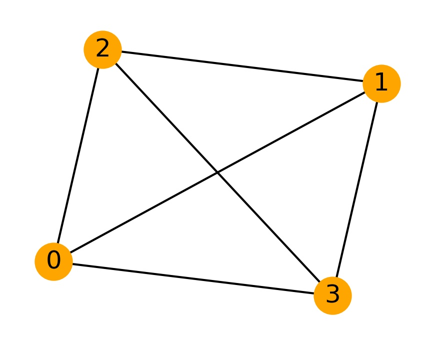
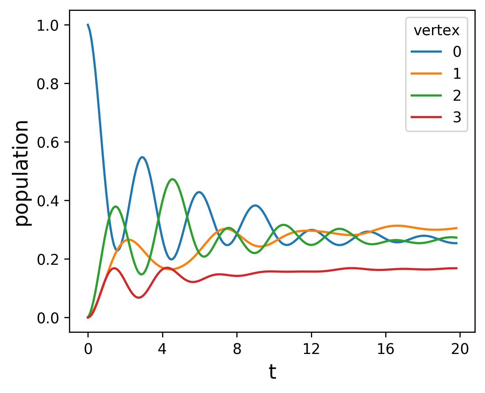
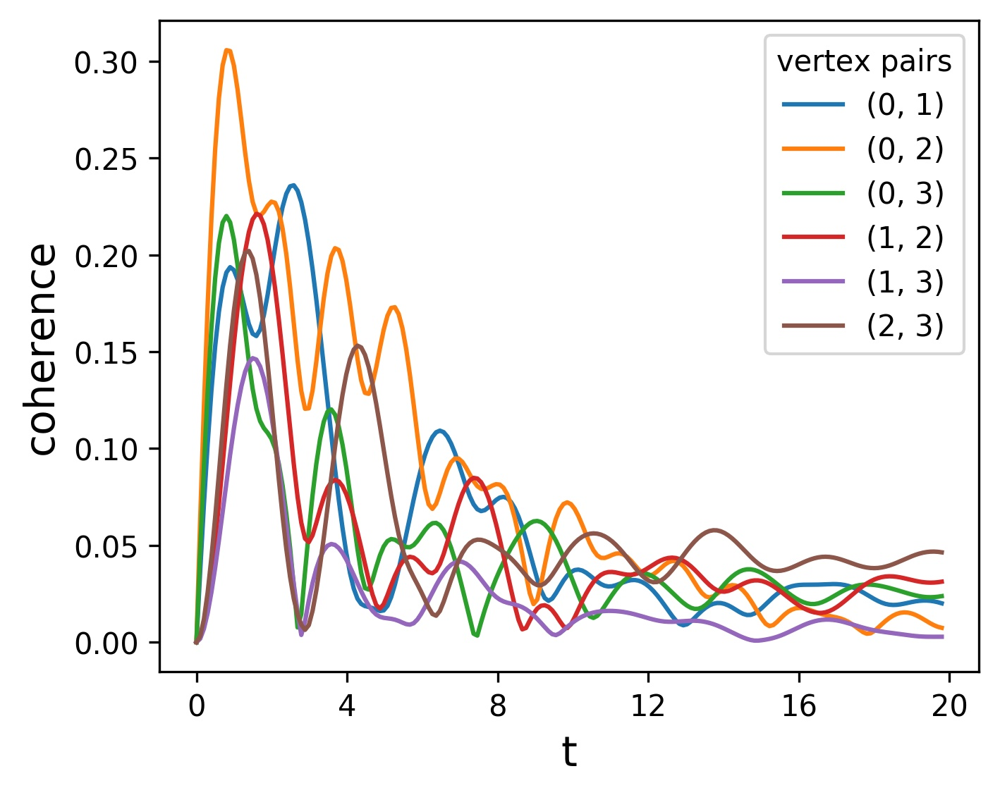
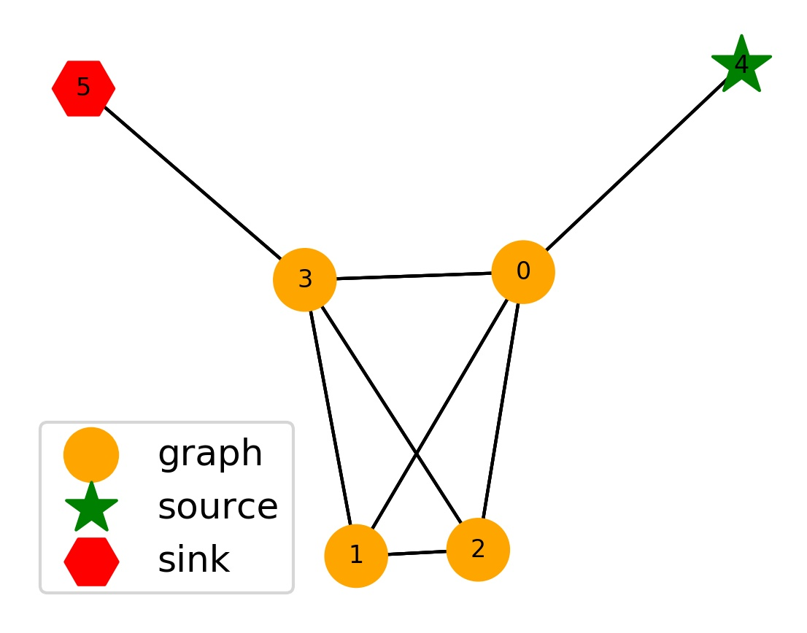
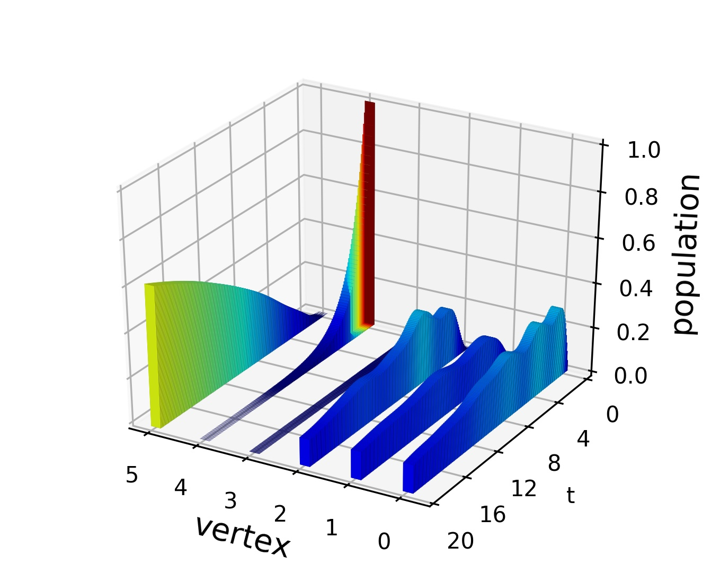
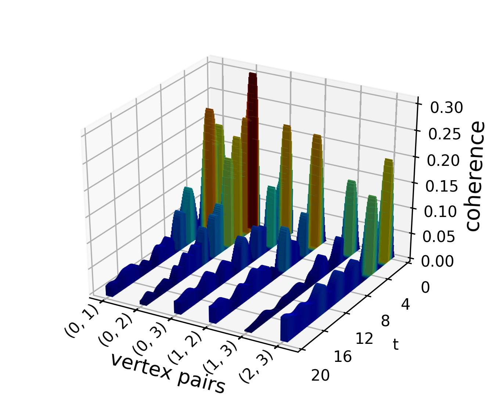

Usage Example
=============

As MPI based programs are parallelized through running multiple instances of the same program, they do not support the use of interactive environments such as the Jupyter notebook. The following code is to be placed in 'example.py', which is then run by issuing the terminal command:

.. code-block:: bash

   mpirun -N n python example.py

where n is a user specified parameter equal to the number of MPI nodes. Another possible workflow is to save the simulation results to disc and carry out visualization and analysis interactively using the QSW_MPI python modules, exclusive of MPI.py.

Basic QSW simulation
####################

In this example a QSW is simulated on a directed wheel graph, shown below.

First, import the required modules.

.. code-block:: python

   from mpi4py import MPI
   import qsw_mpi as qsw
   import numpy as np
   import networkx as nx

Next, set up the MPI environment. This involves creating an MPI communicator object and defining the process rank.

.. code-block:: python

   mpi_comm = MPI.COMM_WORLD
   rank = mpi_comm.Get_rank()

For this example, Networkx is used to create a wheel graph at each rank. The graph is then converted to a SciPy CSR matrix.

.. code-block:: python

   vertices = 4
   Graph = nx.wheel_graph(vertices)
   G = nx.to_scipy_sparse_matrix(Graph, dtype = np.complex128)

and made directed by assigning random weights between :math:`\left(0, 1\right]` to the edges of G. Note the use of np.random.seed(1): it ensures that each MPI process generates the same sequence of random numbers.

.. code-block:: python

   np.random.seed(1)
   for i in range(G.count_nonzero()):
       G.data[i] = G.data[i]*np.random.random()

From G, a directed Laplacian is constructed as per Equation :ref:`[4] <transition_matrix>`. This is used to obtain the Lindblad matrix and then symmetrised to obtain the Hamiltonian as defined in Equation :ref:`[5] <schrodinger_equation>`.

.. code-block:: python

   gamma = 1
   H = qsw.operators.graph(gamma, G)
   L = qsw.operators.site_lindblads(H)
   qsw.operators.symmetrise(H)

A walk object is then instantiated; upon creation, it constructs the distributed super-operator :math:`\tilde{\mathcal{L}}` and determines its 1-norm power series.

.. code-block:: python

   omega = 0.1
   wheel_graph = qsw.MPI.walk(omega, H, L, mpi_comm)

The initial state of the walker, :math:`\rho(0)`, is then defined and passed to the walk object which vectorizes and partitions the density matrix over the MPI communicator. Note that Python is 0-indexed, meaning that the below code specifies an initial state of :math:`\rho(0) = | 1 \rangle \langle 1 |` as per Equation :ref:`[6] <density_matrix>`.

.. code-block:: python

   rho_0 = np.zeros(G.shape, dtype = np.complex128)
   rho_0[0,0] = 1
   wheel_graph.initial_state(rho_0)

A single time point is obtained though use of the 'step' method. 'target' defines the rank to which the :math:`\rho(t)` will be returned.

.. code-block:: python

   t = 5
   rho_t = wheel_graph.step(5, target = 0)

A time series is obtainable using the 'series' method.

.. code-block:: python

   t1 = 0
   t2 = 5
   steps = 50
   rho_t_series = wheel_graph.series(t1, t2, steps, target = 0)

To analyse the results, it is essential to act on 'rho\_t' and 'rho\_t\_series' from the target rank: they will not be defined elsewhere. This is achieved by simply enclosing these tasks in an 'if' statement which checks that the process rank is equal to the target rank. Analysis may proceed by acting directly on the 'rho\_t' and 'rho\_t\_series' numpy arrays, or through use of the QSW\_MPI measurements sub-module. For example, the vertex populations are obtained by

.. code-block:: python

   if rank == 0:
      pop_step = qsw.measure.populations(rho = rho_t)
      pop_series = qsw.measure.populations(rho = rho_t_series)

where, as expected, the last element of 'pop\_series' is equal to 'pop\_step' and the populations at each time-step sum to 1.

.. code-block:: python

   print(pop_step)
   print(pop_series[50])
   print(np.sum(pop_step))

::

   [0.25851439 0.17227131 0.427752   0.1414623 ]
   [0.25851439 0.17227131 0.427752   0.1414623 ]
   0.9999999999999978

Inter-vertex coherence can likewise be extracted with the coherences method.

.. code-block:: python

   vertex_pairs, cohs = qsw.measure.coherences(rho = rho_t_series)

The obtained population and coherence measurements can be visualized using :meth:`~qsw_mpi.plot.population_lines` and :meth:`~qsw_mpi.plot.coherence_lines`, as shown below.

Using this 'walk' object, multiple simulations may be carried out with different :math:`\rho(0)` and values of :math:`\omega`. QSW\_MPI supports a small number of default initial states; for example, 'even' creates :math:`\rho(0)` in an equal superposition across all vertices.

.. code-block:: python

   wheel_graph.initial_state('even')
   wheel_graph.set_omega(0.5)

Introducing Dissipators
#######################

This model may now be expanded to include absorption and emission processes, with the connection of 'sources' and 'sinks' to the graph following the conventions defined in Equations :ref:`[14] <source>` and :ref:`[15] <sink>`. These are described by tuples of two NumPy arrays, the first giving the point of connection and the second the absorption or emission rates at those vertices, noting again that Python is 0-indexed.

.. code-block:: python

   sources = ([0], [0.7])
   sinks = ([3], [0.8])

The resulting graph is shown below.

As these additions result in a structural change in :math:`H` and :math:`L`, it is necessary to create a new walk object.

.. code-block:: python

   wheel_graph_augmented = qsw.MPI.walk(omega, H, L, mpi_comm, sources = sources, sinks = sinks)

When running a simulation either remotely or for a large system, it is more convenient to save the output directly to disc. To do so, first create a .qsw file to contain the results of walk carried out using the 'wheel\_graph\_augmented' object. This walk makes use of another default initial state: 'sources', which distributes :math:`\rho(0)` over all defined source vertices. The 'chunk\_size' parameter controls the number of time-steps between each write to disc. By default, chunked saving is automatically enabled for series with an estimated output size greater than 4 GB.

.. code-block:: python

   wheel_graph_augmented.File('usage_example', action = 'w')

   wheel_graph_augmented.initial_state('sources')

   wheel_graph_augmented = qsw.MPI.walk(omega, H, L, mpi_comm, sources = sources, sinks = sinks)

   wheel_graph_augmented.series(t1, t2, steps, save = True, name = 'series 1', chunk_size = 5)

Vertex populations and coherences can be extracted directly from the .qsw file, thus avoiding the need to load the entire series into memory.

.. code-block:: python

   if rank == 0:

      file = qsw.io.File('usage_example')

      pop_series = qsw.measure.populations(rho = rhot)
      vertices_pairs, cohs = qsw.measure.coherences(rho = rho_t_series)

These are visualized below using :meth:`~qsw_mpi.plot.population_bars` and :meth:`~qsw_mpi.plot.coherence_bars`. With a higher number of verticies a 3D plot can add some clarity.

Later, further simulations with the same system may be conducted by initializing 'wheel\_graph\_augmented' using the 'usage\_example.qsw' which contains all of the arrays necessary to reconstruct the same super-operator and a record of the :math:`\rho(0)` used for saved walks.

.. code-block:: python

   wheel_graph_augmented.File(omega, 'usage_example', mpi_comm)
